<h1>

5项关卡设计

</h1>

`菖蒲`
<!-- TOC -->

- [0.原则](#0原则)
    - [星星系统](#星星系统)
- [1.火车跑酷](#1火车跑酷)
    - [球型](#球型)
    - [玩法](#玩法)
    - [物件](#物件)
    - [场景风格](#场景风格)
    - [优势](#优势)
- [2.小球进洞](#2小球进洞)
    - [球型](#球型-1)
    - [玩法](#玩法-1)
    - [物件](#物件-1)
    - [场景风格](#场景风格-1)
    - [优势](#优势-1)
- [3.多米诺竞速](#3多米诺竞速)
    - [球型](#球型-2)
    - [玩法](#玩法-2)
    - [物件](#物件-2)
    - [场景风格](#场景风格-2)
    - [优势](#优势-2)
- [4.彩虹音符](#4彩虹音符)
    - [球型](#球型-3)
    - [玩法](#玩法-3)
    - [物件](#物件-3)
    - [场景风格](#场景风格-3)
    - [优势](#优势-3)
- [5.机器人先生](#5机器人先生)
    - [球型](#球型-4)
    - [玩法](#玩法-4)
    - [物件](#物件-4)
    - [场景风格](#场景风格-4)
    - [优势](#优势-4)
- [6.火烧赤壁](#6火烧赤壁)
    - [球型](#球型-5)
    - [玩法](#玩法-5)
    - [物件](#物件-5)
    - [场景风格](#场景风格-5)
    - [优势](#优势-5)
- [7.红白机游戏](#7红白机游戏)
    - [球型](#球型-6)
    - [玩法](#玩法-6)
    - [物件](#物件-6)
    - [场景风格](#场景风格-6)
    - [优势](#优势-6)
- [8.滚雪球](#8滚雪球)
    - [球型](#球型-7)
    - [玩法](#玩法-7)
    - [物件](#物件-7)
    - [场景风格](#场景风格-7)
    - [优势](#优势-7)
- [9.艺术就是爆炸](#9艺术就是爆炸)
    - [球型](#球型-8)
    - [玩法](#玩法-8)
    - [物件](#物件-8)
    - [场景风格](#场景风格-8)
    - [优势](#优势-8)
- [10.结算界面](#10结算界面)
    - [球型](#球型-9)
    - [玩法](#玩法-9)
    - [物件](#物件-9)
    - [场景风格](#场景风格-9)
    - [优势](#优势-9)

<!-- /TOC -->

## 0.原则

- 美术重用：优先使用已完成的美术素材
- 程序复用：优先采取已实现的交互逻辑
- 聚焦玩法：第一个机关（进入处）玩法本身成为整关引导，让玩家自适应学习

### 星星系统
关卡中增加星星，提升关卡复玩性。收集后可在主世界解锁皮肤（未被采用的球类，仅有皮肤没有玩法）

## 1.火车跑酷

### 球型
绿皮车厢/乘务员服/邮差球
主题：主人公乘坐火车的记忆

### 玩法
玩家选择一条线路，上车后车辆匀速行驶，玩家需要在车厢上躲开障碍物（均在火车上方），收集星星，顺利到达终点

**第一个机关**
按圆形或直线运行的火车，需要从火车上进入关卡

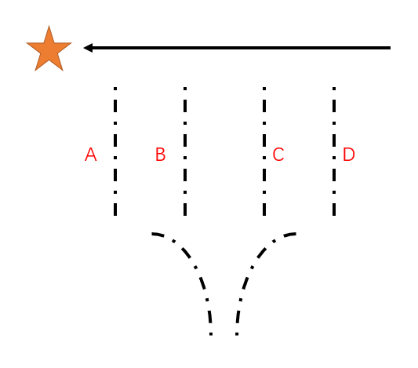

障碍物有三种：
- 固定的圆环
低圆环：必须跳跃，否则会被卡下车
高圆环：选择跳跃，收集星星

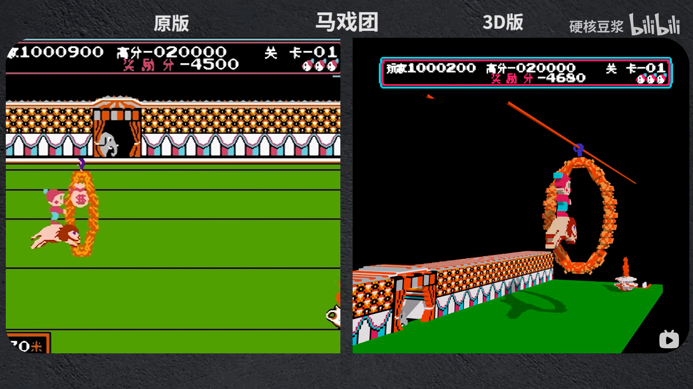
- 固定的横板
低横板：必须跳跃，否则会被卡下车
高横板：紧跟在低横板后一段距离，意味着玩家需要提前跳跃低，否则跳跃后会被高横板卡住

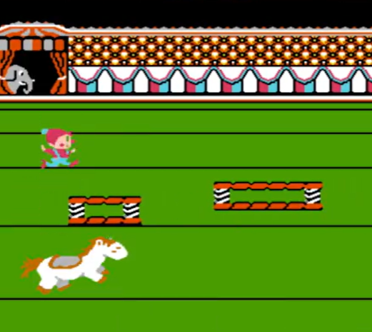
- 弹跳的弹簧
低弹簧：必须跳跃，否则会被卡下车，给一个固定45度的力
跳跃到弹簧上，会距离车头更近；跳跃过弹簧，则不会；因此玩家不能每次都跳上弹簧，否则会超过车头而坠落
高弹簧：到达终点前连续放置多个弹簧，让玩家高飞到终点

- 大断层
第四条轨道在中途火车即下落，有多个弹簧让玩家一飞冲天到达目的地
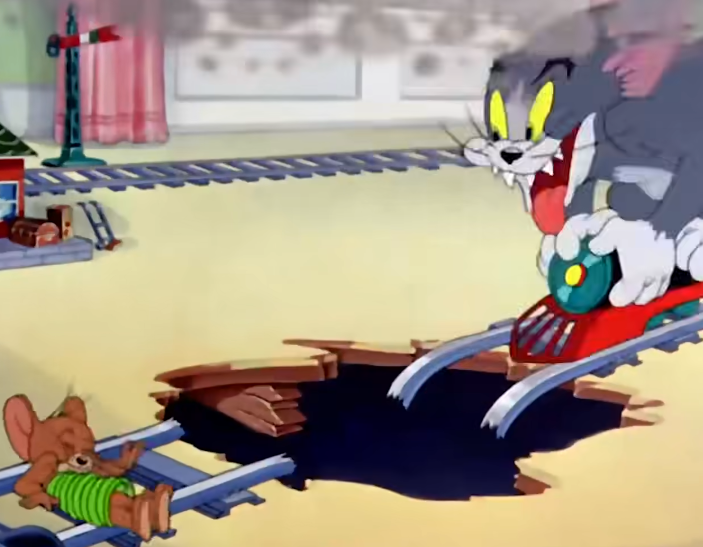

四条轨道都可以到达终点，但一次只能选择一条，增加复玩性

### 物件
火车轨道
车厢
固定的圆环
固定的横板
弹跳的弹簧

非必要：两边的原野，房屋等

### 场景风格
重复的，休闲的
一张铁路背景即可，聚焦于一直向前的车厢本身

### 优势
火车和弹簧已产出
道具多次复用，四条轨道互相独立可放置4种不同侧重玩法的机关（圆环，横板，弹簧，多弹簧）

## 2.小球进洞

### 球型
- 喜欢凿洞的仓鼠球
- 目标是进洞的高尔夫球
- 弹珠

### 玩法
在每一个区域寻找类似洞的东西，进入后弹入到下一个区域
**第一个机关**
从勺子进入关卡
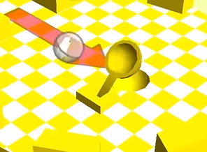

- 地上摆放一堆小积木，进入有洞的玩具

- 撞倒空瓶子，瓶盖掉落，进入瓶盖

- 打开台灯在纸上烧出洞，或照出圆影子洞

- 推倒锤子在一块平底上砸出洞（位置固定）

### 物件
小积木
瓶子
台灯
锤子

其他：干扰项杂物和平台跳跃物，例如纸巾盒，礼物盒等等
### 场景风格
玩具房风格

### 优势
小积木，瓶子，台灯已产出
洞形式的不断变化，让玩家眼前一亮，带来新奇的感觉
机关可扩展性强，任何可以产生圆形物体的内容均可以加入到各自独立的区域中，例如
光盘
魔术帽
轮盘赌

## 3.多米诺竞速
### 球型
轮胎球
彩虹球
骰子点数球
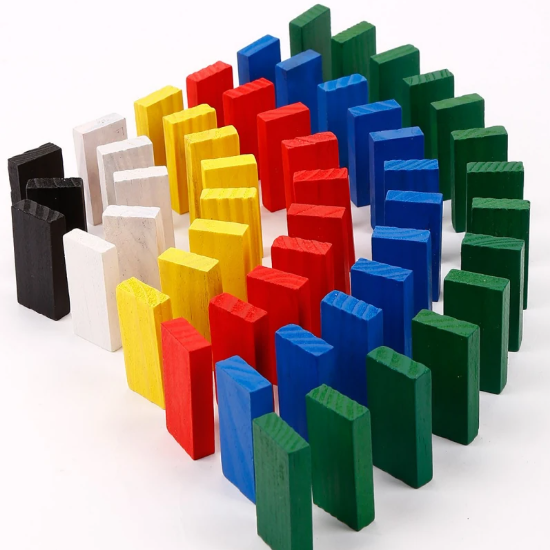

### 玩法
在起点推倒多米诺，在多米诺倒塌前来到终点，借助多米诺倒下触发机关的瞬间前往下一区域

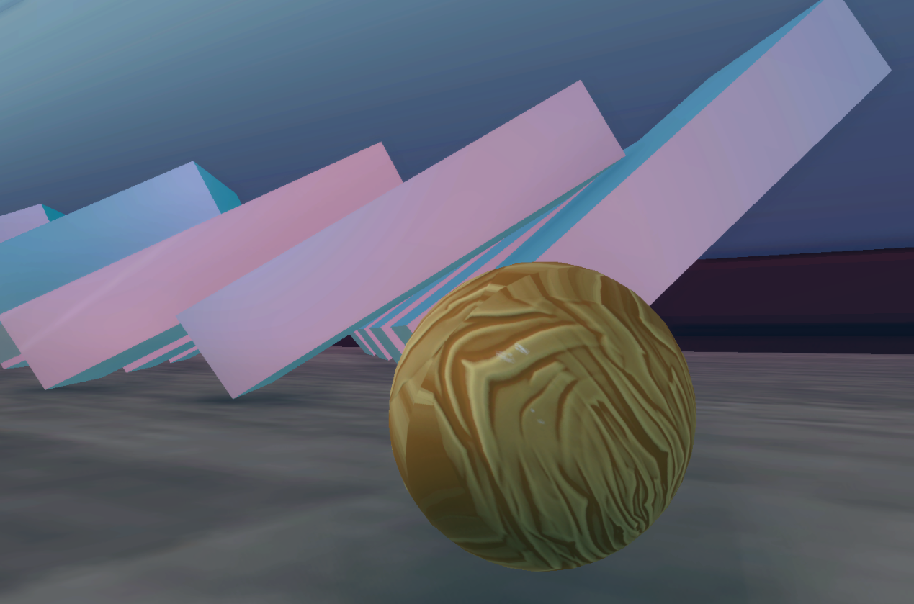
**第一个机关**
推倒三个多米诺并限时来到勺子上，等待多米诺击打勺子把，把球弹飞进关卡

- 跷跷板
推倒S型的多米诺并限时来到跷跷板另一端，飞往下一区域
- 风扇
推倒Y型的多米诺并限时来到倒下的风扇上，一侧多米诺会打开风扇（先），一侧多米诺会遮盖挡住风扇（后）
- 气垫
推倒W型的多米诺并限时来到气垫上，扎第1个气垫，爆炸冲击来到平台2；扎第2个气垫，爆炸冲击来到平台3；我们来到气球上，多米诺解开第3个气球，上浮带我们到达关卡终点
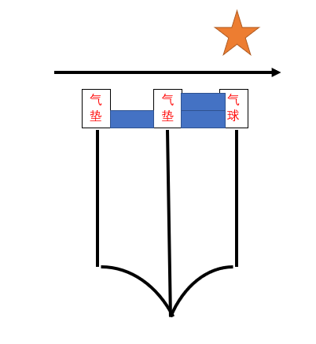
### 物件
多米诺
跷跷板
风扇
气垫
柜子

### 场景风格
玩具房

### 优势
多米诺，风扇，气垫，柜子已产出
大型多米诺的并排前进，制作实现上可批量复制，但具备震撼的视觉效果与解压感

## 4.彩虹音符

### 球型
迪厅球
光球
彩虹球
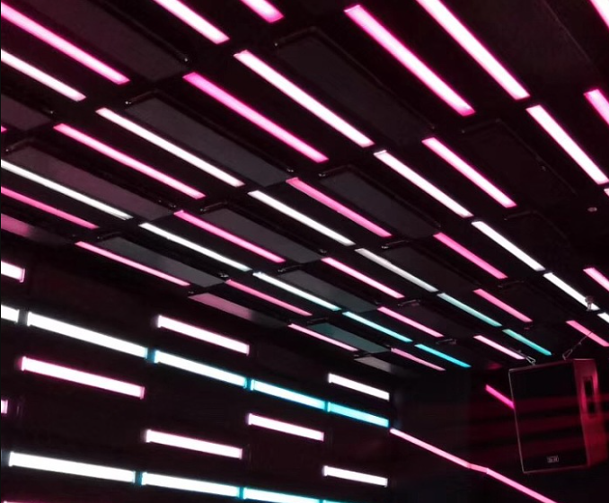
### 玩法
在每一个区域寻找可发出声音的东西，打开后弹出音符，从音符跳到下一个区域
**第一个机关**
玩具黑白琴键，踩上去弹出音符，借助音符跳跃进入关卡
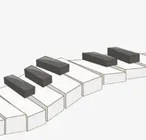

- 平板（屏幕显示播放键，每次点击播放或暂停）

- 卡祖笛
跳到卡祖笛的孔口，可弹出奇怪的音符
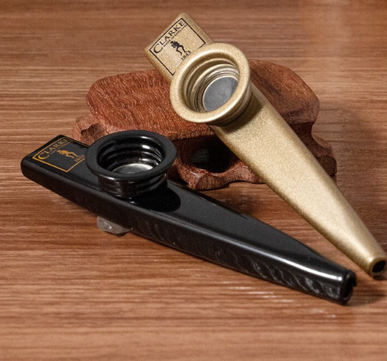

- 收音机
在收音机下方打开开关，收音机上方弹出音符，先跳到收音机上方，再跳到音符上

- 音乐玩偶（如尖叫鸡，电音蝌蚪）
直接跳无法发出声音，必须从第二层的平台向下跳，才能撞击出声音

### 物件
黑白琴键
平板
卡祖笛
收音机
音乐玩偶

其他：干扰项杂物和平台跳跃物，例如纸巾盒，礼物盒等等
### 场景风格
玩具房风格

### 优势
平板，收音机已产出
七个音的黑白琴键在主场景，玩家可以通过跳跃弹奏简单乐曲
机关可扩展性强，任何可以产生声音的内容均可以加入到各自独立的区域中，例如：
徐盛武将牌，跳上去弹出酒和刀

## 5.机器人先生

### 球型
机械球
电子智能球
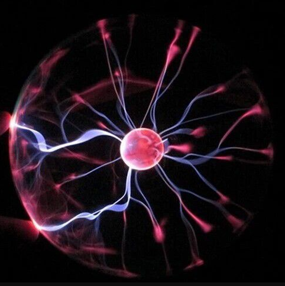
### 玩法
启动机器人的不同部位，扫清障碍离开仓库
**第一个机关**
跳到大大的机器人头部按钮，机器人启动平移到关卡面前，进入关卡

- 旋转机械臂
跳到机器人的手臂上按钮，手臂进行自转，打飞箱子障碍物

- 扫清障碍物
跳到机器人的脚部履带按钮，履带运动，撞开大门

- 开高达
完成关卡后，跳入大场景的机器人胸口，可以操控机器人运动

### 物件
机器人
箱子

其他：干扰项杂物和平台跳跃物，例如纸巾盒，礼物盒等等
### 场景风格
杂物间仓库风格
### 优势
机器人，箱子已产出
开高达

## 6.火烧赤壁
### 球型
火球

### 玩法
点亮区域，直到找到油漆桶燃烧，走出迷宫
**第一个机关**
点亮木材堆，进入关卡

- 可点亮地点A
场景全黑，火球附近2*2可见，前进直接点亮A
- 可点亮地点B
点亮A后，地点B可见，路途中可以收集星星，以此类推
- 可点亮地点X
点亮此地后，全场可见，发现油漆桶就在入口处，到达后，火烧迷宫，然后直线来到出口。下次进入后，可以直奔油漆桶通关

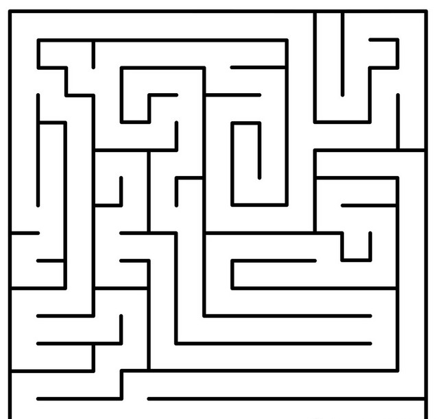

### 物件
可点亮地点（木材堆/火炬/油灯）
板子
桶

### 场景风格
简单，昏暗

### 优势
简单的制作带来较长时间的游玩
用毁灭迷宫来走出迷宫，方式反传统
出口就在入口处的反转，如果玩家误打误撞直接通关会很兴奋

## 7.红白机游戏
### 球型
龙珠
精灵球
像素球
### 玩法
进入电视机，进行一个短关卡
**第一个机关**
撞击？方块，弹出关卡

- 上阶梯，跳到旗杆
不同于在旗杆下落，而是直接撞倒旗杆，然后通关

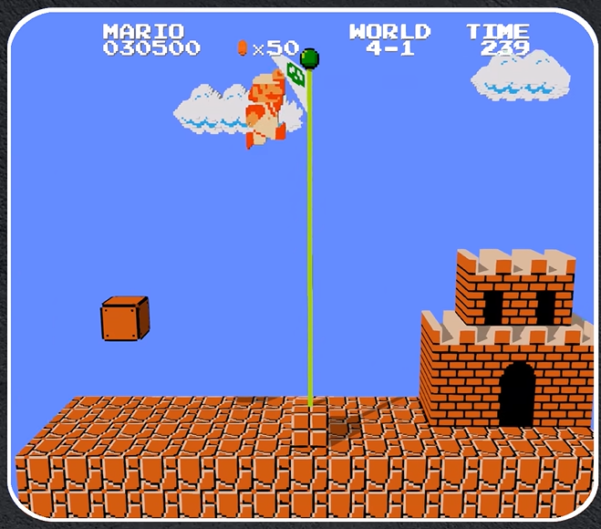
### 物件
方块
旗杆

### 场景风格
像素

### 优势
都是致敬
出其不意的结局

## 8.滚雪球

### 球型
雪球
### 玩法
从高处滚到终点，遇到障碍体积减少，遇到小雪堆体积增大
**第一个机关**
遇到3个小雪堆，体积变大

- 悬崖
途中有悬崖，会以超快速度飞跃悬崖
- 终点
有一排从小到大的雪球，前进遇到小雪球吃掉，遇到大雪球即粘在一起，变为一个雪人，雪人越大，星星越多
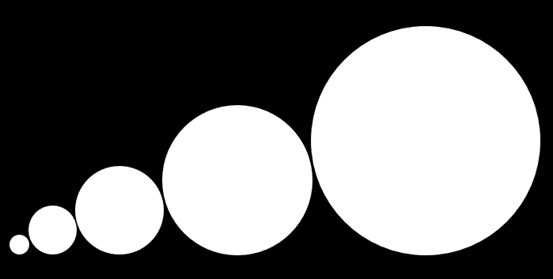
### 物件
雪堆
障碍（木头倒刺）
指示牌，位于终点

### 场景风格
极简，白茫茫
### 优势
无伤通关可以获得更多星星

## 9.艺术就是爆炸
### 球型
曼妥思球
### 玩法
在区域内寻找各种汽水，然后喷发到下一个区域，最终将顶部的所有曼妥思球推入中央的汽水池形成向上喷发的烽火台，落入即可飞上顶部终点
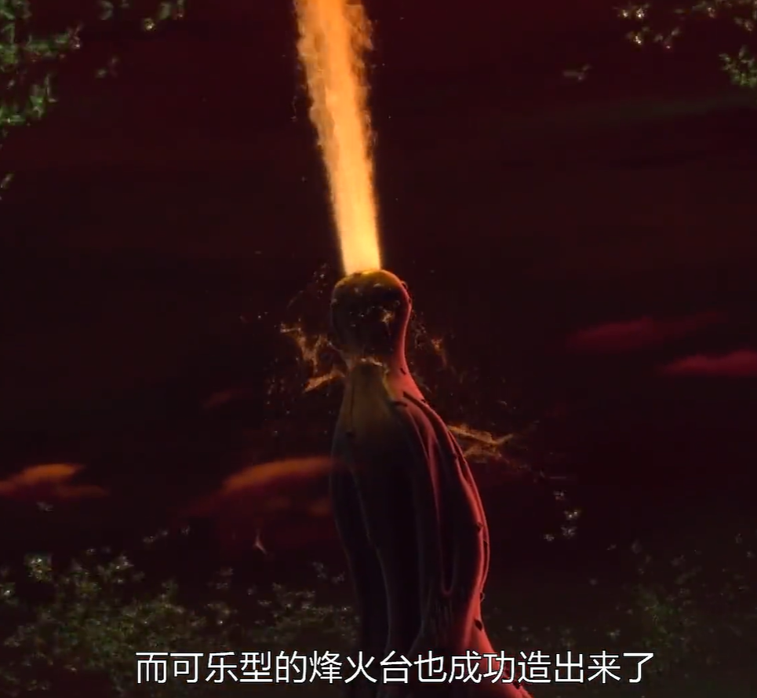
**第一个机关**
跳入雪碧瓶，喷射到关卡

- 平台A
先将汽水瓶冲击到45度，再跳入
- 平台B
汽水瓶向上冲击，再向水平冲击，需要跳过横板
- 平台C
放满了曼妥思球，全部推下去

### 物件
雪碧瓶
柜子
汽水湖

### 场景风格

### 优势
雪碧瓶，柜子已产出
壮观的通关画面

## 10.结算界面
### 球型
地球

### 玩法
- 通关所有关卡，或全星星收集后，房间所有物体变为彩色，中间的门打开，进入来到另一个场景
- 从平台下落，期间背景上闪回游戏过程中的所有物件（音符，火车，机器人，多米诺……），以淡淡的彩色的风格为主，BGM从幽静到豁然开朗拨云见日的感觉
- 大概20秒后，展示玩所有游戏物件，小球掉落到地球，瞬间变成另一个地球，然后通过间断的几个镜头（卡点BGM）让地球慢慢变小，显示出整个银河系
- 最后屏幕中央显示：宇宙中的一粒尘埃，也可以染上不同色彩
（完，单击回到主世界）

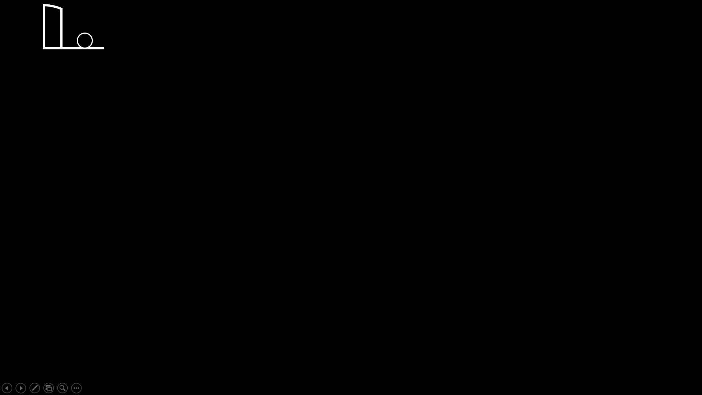

### 物件
地球

### 场景风格
一张银河系图片背景

### 优势
- 通过全黑白的极简线条，到逐渐显示色彩，配上BGM给玩家治愈的感受
- 下落过程中，callback游玩过程中的所有道具
- 球体从非常小下落，然后触碰地球变非常大，再切镜头到整个宇宙，又让球体变得非常小，通过大小的瞬间变化对比，带以震撼和哲思
